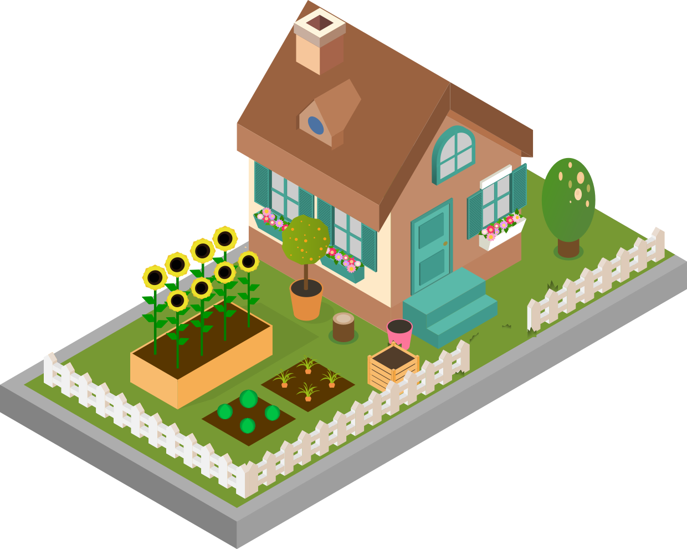

## Research Visuals

A selection of figures from my research presentations on water quality and precipitation forecasting.
<br><br>
The associated publications provide the methods, results, and full author credits.
<br><br>
[Get in touch about the research](contact.qmd).

---

### Water quality & transfer learning

```{=html}
<div class="modular-gallery">
  
</div>
```

From my presentation of the water quality study. [Luo et al. (2023), Environmental Science and Pollution Research](https://doi.org/10.1007/s11356-023-31068-5).

### Precipitation nowcasting

```{=html}
<div class="modular-gallery">
  
</div>
```

From my presentation of the precipitation nowcasting study. [Luo et al. (2026), Hydrological Sciences Journal](https://doi.org/10.1080/02626667.2025.2587687) · [Code](https://github.com/kiwiyolo/Suitable-coupling-for-PN).

### Around the community

The buildings below are navigation elements of this website's illustrated community.

```{=html}
<div class="micro-gallery">
  <a href="about.html"></a>
  <a href="earth-system.html"></a>
  <a href="open-science.html"></a>
  <a href="contact.html"></a>
</div>
```

<br><br>

For the scientific context and reuse information, consult each original publication and its licence.

<div id="img-popup" class="img-popup hidden">
  <p>
    Have a question about a research figure?<br>
    <a href="contact.html">Contact me here!</a>
  </p>
  <span class="close-popup">×</span>
</div>

<script>
  const popup = document.getElementById("img-popup");
  const closeBtn = document.querySelector(".close-popup");

  document.addEventListener("contextmenu", function(e) {
    if (e.target.tagName === "IMG") {
      e.preventDefault();
      popup.classList.remove("hidden");
    }
  });

  closeBtn.addEventListener("click", function() {
    popup.classList.add("hidden");
  });

  document.addEventListener("click", function(e) {
    if (!popup.contains(e.target)) {
      popup.classList.add("hidden");
    }
  });
</script>
