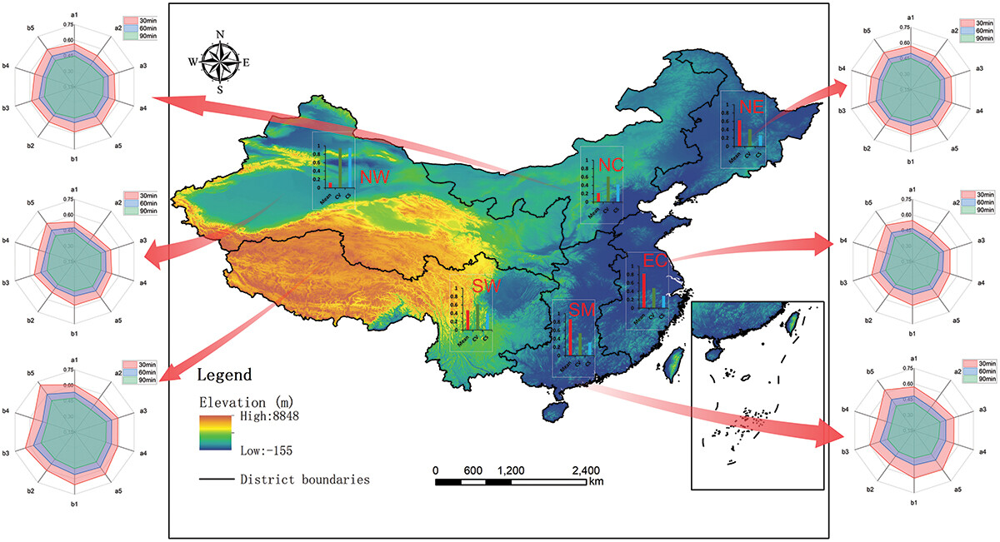
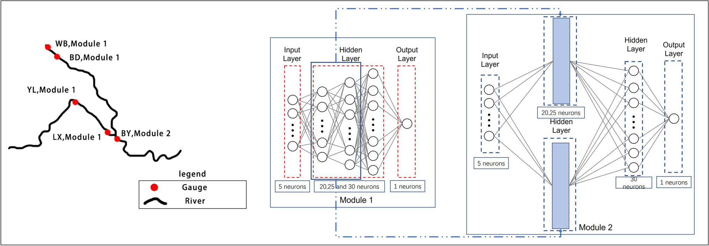

::: {.page-icon}

:::

## Projects {#current-research}

```{=html}
<div class="research-gallery">

<div class="project-card">
  <a href="earth-system.html">
    
    <h3>Earth System & AI</h3>
    <p>Water quality, precipitation nowcasting, runoff change, and seasonal ocean forecasting.</p>
  </a>
</div>

<div class="project-card">
  <a href="talks.html">
    
    <h3>Talks & Conferences</h3>
    <p>Conference contributions and conversations about hydrology, Earth systems, and AI.</p>
  </a>
</div>

<div class="project-card">
  <a href="open-science.html">
    
    <h3>Open Science</h3>
    <p>Public research code, reproducibility, and resources associated with my work.</p>
  </a>
</div>

<div class="project-card">
  <a href="datasets.html">
    
    <h3>Datasets</h3>
    <p>Data sources and access information for the studies in my publications.</p>
  </a>
</div>

<div class="project-card">
  <a href="illustrations.html">
    
    <h3>Research Visuals</h3>
    <p>Figures from my research on water quality and precipitation forecasting.</p>
  </a>
</div>

<div class="project-card">
  <a href="publications.html">
    
    <h3>Publications</h3>
    <p>My journal articles and conference contributions, with links to the original publications.</p>
  </a>
</div>

</div>
```
