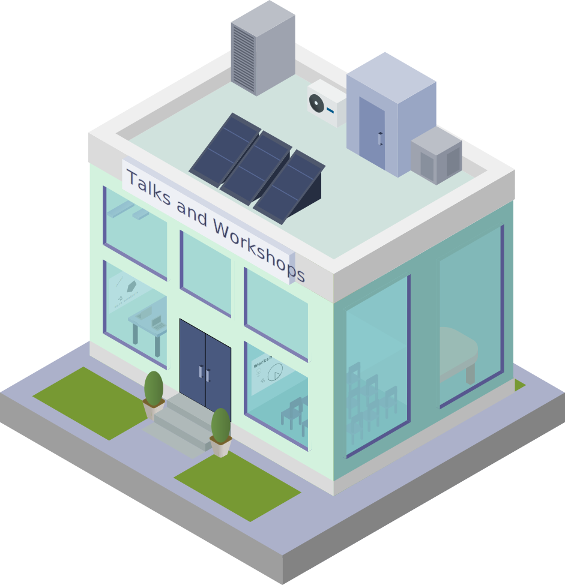

::: {.page-icon}

:::

## Talks & Workshops {#talks-workshops}

My public speaking and teaching work is split between technical training for researchers and public engagement for broader audiences.   I believe that if research is not shared in an accessible way, the work is functionally incomplete.

### Technical Training

 

##### *Upcoming*

- **Software Carpentry Workshop** - Philipps University Marburg  
  *March 3-4, 2026*  
  [Event link](https://jengelmann.github.io/2026-03-03-Phillips-University-Marburg-Online/)

##### *Recent*  
- **Winter School 2026** - SARA Institute of Science  
  *January 23-27, 2026*  
  [Github Repo](https://github.com/cecibaldoni/SARA-WW-2026)
  
- **How to start your own Code Club** - SORTEE Unconference 5  
  *October 16th, 2025* 
  [Open Guide](https://sortee.github.io/start-your-codeclub-guide/) · [Slides](https://cecibaldoni.quarto.pub/how-to-start-your-own-code-club/#/title-slide) · [Github Repo](https://github.com/SORTEE/start-your-codeclub-guide)
  
- **Data wrangling with {tidyverse}**   
  *July 26th, 2025*  
  [Event link](https://sara-edu.netlify.app/summer/2025-r4b/) · [Slides](https://cecibaldoni.github.io/data-wrangling-tidyverse/#/title-slide) · [YouTube](https://youtu.be/KcyZRyf2VKM?si=kUwZT4OUbOOeGXin)

- **Scrollytelling Science with Quarto and Closeread**   
  *May 28th, 2025*  
  [YouTube](https://www.youtube.com/watch?feature=shared&v=ytKZ357Xtqw) · [Slides](https://cecibaldoni.github.io/scrollytelling-quarto-closeread/#/TitleSlide)

- **What is Open Science Anyway?**   
  *February 14th, 2025*  
  [Event link](https://www.ab.mpg.de/events/40760/345436) · [Slides](https://github.com/cecibaldoni/OpenScience-Rado)

- **SORTEE Code Club**   
  *2025*  
  [List of events](https://docs.google.com/spreadsheets/d/1rOOOE7ghPduwtFftG0DJJf0DXVigAdcmQ0xdEwbKQXo/edit)

- **Personal Knowledge Management and Note-Taking Apps**  
  *December 2024 - November 2025*  
  [Open Resources](https://github.com/cecibaldoni/PKM-workshop)

### Public Engagement

- **Building Inclusive Computational Skills**  
  *WiCS+E · February 23rd, 2026*  
  [Event link](https://www.eventbrite.co.uk/e/building-inclusive-computational-skills-online-panel-discussion-tickets-1981353031253) · [Slides](https://cecibaldoni.github.io/WiCS-panel/#/title-slide)

- **Shrinking shrews: what a small mammal can teach us about brain and behavior**  
  *Univesität Konstanz, Germany · November 20th, 2025* 
  [Open Science Slam](https://www.kim.uni-konstanz.de/kim-news/news-detailseite/open-science-slam-2025/) - *Invited Talk*  

- **The curious case of the Common Shrew**  
  *Hochrhein-Seminar für Mathematik und Naturwissenschaften · November 7th, 2025*  
  [Event link](https://hochrhein-seminar.de/2025/11/vortrag-fuer-die-oberstufe-am-7-11-25/)

- **Live from the nesting box – programming for birds**  
  *MAXCINE, Germany · October 3rd, 4th, 5th, 2025*  
  [Event link](https://www.maxcine.de/events/workshop-3-live-from-the-nesting-box-programming-for-birds) · [Poster](../img/MF_Plakat.jpg){target="_blank"}

### In the Media

- "Rare seasonal brain shrinkage in shrews is driven by water loss, not cell death" - [Max Planck Society](https://www.ab.mpg.de/743885/news_publication_25258209_transferred)

- "Cervello del toporagno si restringe in inverno e rinasce in estate: c'è qualcosa da imparare?" - [Alzheimer Reise]((https://www.alzheimer-riese.it/contributi-dal-mondo/ricerche/13165-cervello-del-toporagno-si-restringe-in-inverno-e-rinasce-in-estate-ce-qualcosa-da-imparare?fbclid=IwY2xjawMufO1leHRuA2FlbQIxMQBicmlkETA0V0c4bnBRZ1RpMExPVjZrAR4a9cx52JNMZ7tzeut_eTJU4hvVoPMjMz66SovPjbggcnVJDUAil1NCbtYs0A_aem_khVQDoOrjck4yXV8uLroUg))

- "Wasserverlust lässt das Gehirn von Spitzmäusen im Winter schrumpfen" - [Vbio](https://www.vbio.de/aktuelles/details?tx_news_pi1%5Bnews%5D=33565&cHash=51215d4c198198ba0a36e7c9350213c4)

- "Rare seasonal brain shrinkage in shrews is driven by water loss, not cell death, MRI study reveals" - [Phys Org](https://phys.org/news/2025-08-rare-seasonal-brain-shrinkage-shrews.html)
  
- "Shrews' Seasonal Brain Shrinkage Tied to Water Loss" - [MirageNews](https://www.miragenews.com/shrews-seasonal-brain-shrinkage-tied-to-water-1524928/#:~:text=Cecilia%20Baldoni%2C%20a%20postdoctoral%20researcher,the%20same%2C%22%20Nieland%20adds.)

- "Shrews That Shrink Their Brains with the Seasons May Hold Clues to Treating Brain Disease" - [DongaScience](https://www.dongascience.com/en/news/73769)
  
- "Gene Expression Shifts as Shrews Shrink and Regrow Their Brains" - [The Scientist](https://www.the-scientist.com/gene-expression-shifts-as-shrews-shrink-and-regrow-their-brains-72364)

- "Scientists found that this tiny mammal ‘regrows’ its brain in winter. And it could help cure Alzheimer’s" - [Discover Wildlife](https://www.discoverwildlife.com/animal-facts/mammals/common-shrew-shrink)

- "Why this mammal eats its own brain" - [Washington Post](https://www.washingtonpost.com/climate-environment/2022/11/30/shrews-shrink-regrow-own-brains/)
---

### Scientific Conferences and Seminars

#### 2025
  
- **Baldoni C.** & Dechmann D.  
  *Beyond the standard: Unconventional vertebrate models in biomedicine, EMBO*  
  Edinburg, UK   
  ***The shrew as a model for brain shrinkage without neurodegeneration***
  
- **Baldoni C.**  
  *Invited Seminar* — *Messerli Institute*  
  Vienna, Austria   
  ***Shrinking Shrews: Cognitive Challenges in a Changing Brain***
  
  
#### 2024

- **Baldoni C.**, Farantouri M., Raptis K., Nourani E., Dechmann D.   
  *International Society for Behavioral Ecology (ISBE)*  
  Melbourne, Australia   
  ***Seasonal Brain Size Variation and Its Impact on Spatial Navigation and Learning in the Common Shrew (*Sorex araneus*)***

#### 2023

- **Baldoni C.**, von Elverfeldt D., Dechmann D.   
  *Wikelski Department Seminar*
  Radolfzell, Germany   
  ***News from the Shrews: Brain structure during Dehnel’s phenomenon from neuroimaging***

- **Baldoni C.**, Farantouri M., Raptis K., Nourani E., Dechmann D.   
  *Animal Behaviour Conference*  
  Bielefeld, Germany  
  ***Brain size and spatial learning in the common shrew (*Sorex araneus*)***

- **Baldoni C.**, Nourani E., Dechmann D.   
  *IV Convegno Nazionale sui Piccoli Mammiferi*  
  Grosseto, Italy  
  ***Seasonal brain size changes affect spatial learning in common shrews (*Sorex araneus*)***

#### 2022

- **Baldoni C.**, Dechmann D.   
  *Animal Behaviour Society*  
  San José, Costa Rica  
  ***Seasonal brain changes impact associative learning in common shrews (*Sorex araneus*)***

#### 2019

- **Baldoni C.**, Scaravelli D., et al.   
  *IV Italian Bat Conference*  
  Padova, Italy  
  ***Nocturnal bat migration at the bird ringing station ‘Bocca di Caset’***

- **Baldoni C.**, Cicero M., et al.   
  *XX Italian Ornithology Conference*  
  Naples, Italy  
  ***Citizen-science approach to Ring-necked parakeet distribution in Bologna***

- **Baldoni C.**, Brucks D., et al.   
  *ASAB Summer Conference*  
  Konstanz, Germany  
  ***Self-control in two macaw species using a rotating paradigm***

#### 2018

- **Baldoni C.**, Giglio G., Scaravelli D.   
  *II European Meeting of Young Ornithologists*  
  Torino, Italy  
  **Effects of fire on birds in Mediterranean woods**
