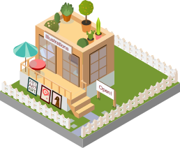
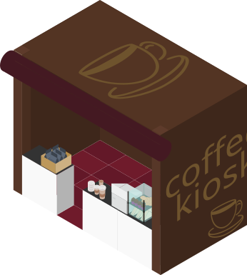
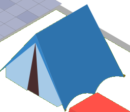
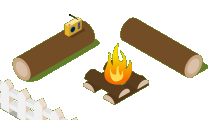
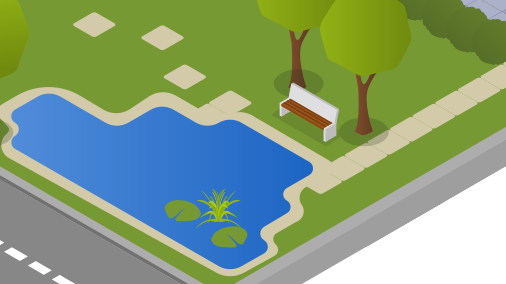
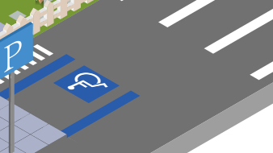
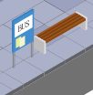

# LUO Qun · 罗群

<br>


```{=html}
<p><strong>地球系统 × 人工智能 × 可解释性。</strong> 我的研究涉及水质预测、降水临近预报、径流变化和海表温度季节预测。我的博士项目为香港理工大学计算学系与 EIT 联合培养项目，起始时间为 2026 年 9 月。</p>
<ul class="ql-highlight-metrics">
  <li>水利工程 · 北京师范大学</li>
  <li>地下水科学 · 中国地质大学（北京）</li>
  <li>科研经历 · 南方科技大学</li>
  <li>面向地球系统的物理可解释人工智能</li>
</ul>
```

**点击下方互动社区中的建筑，了解我的研究、论文、研究图示和文章**.<br><br>
<br>

## 探索社区

```{=html}
<div class="city-wrapper">
  <div class="city-layer">
    

    <a href="content/contact.html" class="city-icon icon-contact">
      
      <span class="city-label">联系我！</span>
    </a>

    <a href="content/about.html" class="city-icon icon-home">
      
      <span class="city-label">关于我</span>
    </a>

    <a href="content/illustrations.html" class="city-icon icon-illustration">
      
      <span class="city-label">研究图示</span>
    </a>

    <a href="content/open-science.html" class="city-icon icon-open-science">
      
      <span class="city-label">开放科学</span>
    </a>

    <a href="content/project.html#current-research" class="city-icon icon-research">
      
      <span class="city-label">研究项目</span>
    </a>

    <a href="content/talks.html" class="city-icon icon-talks-workshops">
      
      <span class="city-label">报告与会议</span>
    </a>

    <a href="blog/index.html" class="city-icon icon-blog">
      
      <span class="city-label">博客</span>
    </a>

    <a href="content/contact.html#book-a-time-to-chat" class="city-icon icon-coffee">
      
      <span class="city-label">预约交流！</span>
    </a>
    <a href="community/life.html" class="city-icon city-new-feature" style="left:9.2744%;top:47.306%;width:4.4795%" aria-label="日常生活（开发中）">
      
      <span class="city-label">日常生活（开发中）</span>
    </a>
    <a href="community/interstellar.html" class="city-icon city-new-feature" style="left:29.5899%;top:75.6466%;width:6.2461%" aria-label="星际穿越（开发中）">
      
      <span class="city-label">星际穿越（开发中）</span>
    </a>
    <a href="community/outdoors.html" class="city-icon city-new-feature" style="left:82.5868%;top:26.8319%;width:8.0757%" aria-label="户外探索（开发中）">
      
      <span class="city-label">户外探索（开发中）</span>
    </a>
    <a href="community/campfire.html" class="city-icon city-new-feature" style="left:76.9716%;top:36.9612%;width:6.7508%" aria-label="围炉夜话（开发中）">
      
      <span class="city-label">围炉夜话（开发中）</span>
    </a>
    <a href="community/garden.html" class="city-icon city-new-feature" style="left:49.5268%;top:67.3491%;width:15.9621%" aria-label="灵感花园（开发中）">
      
      <span class="city-label">灵感花园（开发中）</span>
    </a>
    <a href="community/toolbox.html" class="city-icon city-new-feature" style="left:73.817%;top:50.6466%;width:10.6625%" aria-label="工具箱（开发中）">
      
      <span class="city-label">工具箱（开发中）</span>
    </a>
    <a href="community/journeys.html" class="city-icon city-new-feature" style="left:44.5426%;top:51.5086%;width:3.2177%" aria-label="旅途札记（开发中）">
      
      <span class="city-label">旅途札记（开发中）</span>
    </a>
    <div class="city-runner" aria-hidden="true"><canvas class="city-character-canvas"></canvas></div>
  </div>
</div>
<p class="community-credit">桐人模型：<a href="https://bowlroll.net/file/96677" target="_blank" rel="noopener noreferrer">すがき（すがきれもん）</a> ·《刀剑神域》· 本站渲染跑步动画。</p>
```
